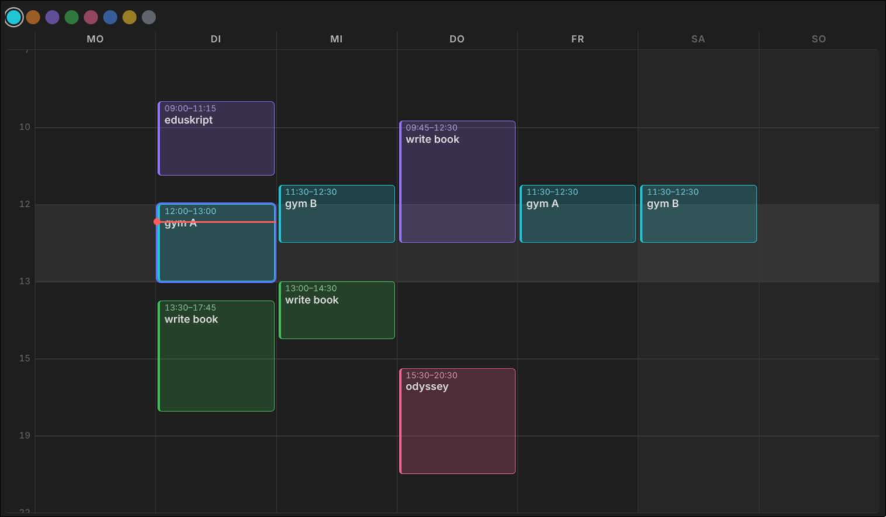

# WeekGrid

A quick'n'dirty Obsidian plugin: a generic Monday–Sunday week grid you can scribble colored blocks onto. Built in an afternoon to draft weeks, not to replace a calendar.

No dates, no sync, no save button. It's a whiteboard shaped like a week.



## Why

Real calendars want dates, invitations, reminders and a save dialog. Drafting a *typical* week needs none of that — just drag a box, name it, move it, done.

## Usage

Put a code block into any note:

````markdown
```weekgrid
id: default
```
````

Then:

| Action | Result |
| --- | --- |
| Drag on a column | new block (click without dragging = 60 min) |
| Double-click a block | edit the title (Enter to commit, Esc to cancel) |
| Drag a block | move it, across days too |
| Drag top/bottom edge | resize |
| Hover a block | copy + delete buttons |
| Click a block, then `1`–`8` | recolor · `Del` deletes · `Esc` deselects |
| Swatches above the grid | color for the next block |

Every change is written immediately to `4_system/weekgrid.json` in your vault — no save button anywhere. Put the vault in Syncthing/Dropbox and the week follows you around.

A red line marks the current time in today's column.

## Options

All optional, one per line in the code block:

```
id: default      # board name — different id = separate week
marks: 7 10 12 13 15 19 22   # the only horizontal lines drawn
midday: 12-13    # shaded band (or: none)
snap: 15         # minutes
height: 44       # half a band's height in px
```

Bands between marks all get the **same** pixel height regardless of duration — 7–10 is as tall as 10–12. That's deliberate: mornings deserve as much drafting space as afternoons. Time inside a band still maps proportionally.

## Install

Not in the community store. Copy `main.js`, `manifest.json` and `styles.css` into `<vault>/.obsidian/plugins/weekgrid/` and enable it under Settings → Community plugins.

## Caveats

Quick'n'dirty means quick'n'dirty:

- Plain JS, no build step, no tests.
- Full re-render on every pointer move. Fine at this size.
- Board data is one JSON file. Two devices editing at once = whoever saves last wins.
- Desktop-tested only, though pointer events should behave on mobile.

MIT.
